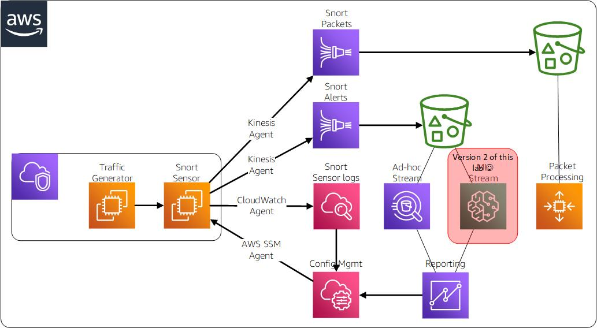
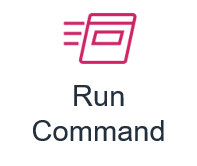

# Intelligent Automation with AWS and Snort IDS

## Description
This project demonstrates some of the ways to can add value to your existing Snort IDS system by integrating it with AWS.
Things you will explore include:
* Centralise and automate management of your Snort Sensors using a number of tools in the Systems Manager service
* Ingest Snort alert and packet data in a scalable, cost effective and secure manner with Kinesis Firehose
* Store your Snort Sensor data in a scalable and cost effective manner using Simple Storage Service S3
* Gain insights from your Snort data usign Analytics services Athena and Quicksight

---


---

## Contents
```
.
|-- README.md                         <-- This instructions file
|-- 1-image-builder-pipeline.yaml     <-- Cloudformation stack for the Image Builder Pipeline
|-- 2-snort-stack.yaml                <-- Cloudformtation stack for Snort sensor
|   |-- artifacts                     <-- Directory for deployment artifacts
|   |   |-- kinesis-install.sh        <-- Installation script for Kinesis using the 'expect' command
|   |   |-- SnortDemo-CodeDeploy.zip  <-- Zip of the codedeploy directory to import into CodeCommit
|-- codedeploy                        <-- Directory for CodeDeploy files
|   |-- agent.json                    <-- Kinesis firehose agent configuration file
|   |-- snortd                        <-- Snort init script
|   |-- snort.conf                    <-- Snort configuration file
|   |-- snort                         <-- Snort init script
|   |-- appspec.yml                   <-- CodeDeploy configuration script
|   |-- local.rules                   <-- Local rules for Snort
|   |-- community.rules               <-- Community rules for Snort
|   |-- black_list.rules              <-- Black List rules for Snort
|   |-- white_list.rules              <-- White List rules for Snort
|   |-- scripts                       <-- CodeDeploy scripts directory
|   |   |-- after_install.sh          <-- CodeDeploy post-installation script
|   |   |-- before_install.sh         <-- CodeDeploy pre-installation script
|   |   |-- start_server.sh           <-- CodeDeploy start server script
|   |   |-- stop_server.sh            <-- CodeDeploy stop server script
```

## Prerequisites
This section describes the pre-requisites you must have in order to sucessfully run this demo.
1. An AWS Account and an IAM user with sufficient privilegses to run the CloudFormation scripts.
2. A PC or Mac with Git installed and a Web Browser compatible with the AWS Console.

## A. Deploy the EC2 Image Pipeline stack
In this section we will use [CloudFormation](https://docs.aws.amazon.com/AWSCloudFormation/latest/UserGuide/Welcome.html "CloudFormation") to deploy [EC2 ImageBuilder](https://docs.aws.amazon.com/imagebuilder/latest/userguide/how-image-builder-works.html "EC2 ImageBuilder") Pipeline stack.  This includes all the components for a Snort Sensor recipe that ImageBuilder can run to produce an AMI.

---


---
1. Log on to the AWS console and open CloudFormation.  Make sure that your current region is **us-east-1**, North Virginia.
2. Select the **Stacks** menu item in the side window.  Click on the **Create Stack** button.
3. In the **Specify Template** page, navigate to the **specify a template** section and select the option to **upload a template file**.
4. Select the **choose file** button, navigate to te directory where you downloaded the package and select the **1-image-builder-pipeline.yaml** file, then click on the **open** button.  Click on the **next** button to continue.
5. In the **Stack Details** page, set the stack name to **ImageBuilderStack**.  Look through the template parameters for your information, then click on the **next** button to continue.
6. In the **configure stack options** page, accept the defaults and click on the *next* buttont to continue.  
7. In the **review ImageBuilderStack** page, scroll to the bottom of the page and make sure that the tickbox **I acknowledge that AWS CloudFormation might create IAM resources with custom names** is ticked.  Click on the **create stack** button continue.

## B. Run the EC2 Image Builder Pipeline
In this section we will run the EC2 Image Builder Pipline to create an AMI that includes the Snort and Kinesis packages along with all their dependancies.

---


---
1. In the AWS Console, open the **EC2 Image Builder** console.
2. Select **Image pipelines** in the menu in the left hand window.
3. Select **SnortImagePipeline** in the right hand window.
4. Click on the **Actions** drop down and select **run pipeline** from the menu.
5. The Pipeline will now generate the AMI to be used to create our Snort Sensor.  After a short time the pipeline will complete.  If your Pipeline failes see the Points to note section below.
6. Navigate to the **EC2** service page and select **AMIs** from the **Images** section.  Verify that the filter dropdown is set to **Owned by Me**.
7. You should see an AMI named **SnortImage-uniqueid**.  Select this image and then copy the **AMI ID** listed in the **Details** tab.  Save this AMI ID value because you will need it for the next step.
8.  **Whoohoo!** you used EC2 Image Builder to create a Linux image with Snort installed.

---
### Points to note:
This AMI can be used in both AWS and on-premisis environments.  To run the image in on-premisis environments, see the documentation at this [link](https://docs.aws.amazon.com/AWSEC2/latest/UserGuide/amazon-linux-2-virtual-machine.html "link").  You can also keep a watch on the AMI build process by navigating ot the **Systems Manager** in the console and selecting **Automations**.  You should see an automation that is progressing and it will take 10 minutes or so to complete.  The Log files for the automation will be stored in an S3 bucket **ImageBuilderStack-ssmloggingbucket-uniqueid** so you can analyse them for any issues.

---

## B. Deploy the Snort stack
In this section we will use CloudFormation to deploy the intial stack.  This includes all the infrastructure needed to get the basic environment working.  The diagram below represents the stack in is current form.

---


---
1. Log on to the AWS console and open [CloudFormation](https://docs.aws.amazon.com/AWSCloudFormation/latest/UserGuide/Welcome.html "CloudFormation").  Make sure that your current region is **us-east-1**, North Virginia.
2. Navigate to the **EC2** console.   
2. Select the **Stacks** menu item in the side window.  Click on the **Create Stack** button.
3. In the **Specify Template** page, navigate to the **specify a template** section and select the option to **upload a template file**.
4. Select the **choose file** button, navigate to te directory where you downloaded the package and select the **2-snort-stack.yaml** file, then click on the **open** button.  Click on the **next** button to continue.
5. In the **Stack Details** page, set the stack name to **SnortStack**.  Set the **LinuxImageId** paremeter to uise the **AMI ID** that you copied in the previous section.  Review the other template parameters for your information, then click on the **next** button to continue.
6. In the **configure stack options** page, accept the defaults and click on the *next* buttont to continue.  
7. In the **review SnortStack** page, scroll to the bottom of the page and make sure that the tickbox **I acknowledge that AWS CloudFormation might create IAM resources with custom names** is ticked.  Click on the **create stack** button continue.

## C. Import the codedeploy artifacts to CodeCommit
---
In this section we will use [Session Manager](https://docs.aws.amazon.com/systems-manager/latest/userguide/session-manager.html "Session Manager") to access the linux hosts.  This uses ephemeral ssh keys to establish a session with eh host and you can run interactive commands.  Its a great way of avoinding the pain of managing ssh keys and makes also makes it unecessary to have a bastion host or exposing your ssh ports to the internet.

---


---
1. In the AWS Console, open the **System Manager** console.
2. Select **Session Manager** in the menu in the left hand window.
3. Click on the **Start Session** button in the right hand window.
4. Click on the **radio button** for the **SnortSensor** EC2 instance. 
5. Click on the **start session** button.
6. Review the cloud-init script output to verify that the installation was sucessful.
```bash
cat /var/log/cloud-init-output.log | more
```
7. **Whoohoo!**  You have not access you new Linux instance without a bastion host or ssh key using an IAM user in the console!  To see more things you can do with session manager in terms of delegating rights and roles check out the documentation [here](https://docs.aws.amazon.com/systems-manager/latest/userguide/session-manager.html "Session Manager").

## E. Download tools package
---
In this section we will copy the artifacts we need to complete the installation to the snort server.  We use github for the example, but you could also use CodeCommit or your own private pipeline.  We execute these commands using the Systems Manager [Run Command](https://docs.aws.amazon.com/systems-manager/latest/userguide/execute-remote-commands.html "Run Command") feature which allows you to apply updates across multiple instances based on tags or instance ids.

---


---
1. In the AWS Console, open the **System Manager** console.
2. Select **Run Command** in the menu in the left hand window.
3. Click on the **Run a command** button in the right hand window.
4. Type **AWS-RunShellScript** into the search bar and press the **return** key. 
5. Select the radio button for the **AWS-RunShellScript** document.
6. Scroll down until you see the **Command Parameters** field.  Copy and past the following commands into that field.
```bash
git clone https://github.com/aws-samples/aws-reinvent-2019-builders-session-opn215
```
7. In the working directory field, type in **/home/ssm-user**.
8. Scroll down to the **Targets** section.
9. Select the radio button for **Specify instance tags**.
10. Type the following values into the feilds for the tags and then click on the **Add** button.

| Tag Key | Value |
| --- | --- |
| SSMType | SnortSensor |

11. Scroll down to the **Output options** section.  Ensure that the **Enable writing to S3 bucket** tickbox is ticked and the **Choose a bucket name from the list** radio button is selected. 
12. Click on the drop down list and select the bucket beginning with the name **SnortStack-ssmloggingbucket-*uniqueid***.  
13. Click on the **run** button to execute the command.
14. You will see the status page for the command execution.  Click on the refresh button a few times until the **sucess** message appears.
15. In the **targets and outputs** section you can see which instances the command ran on. Select an instance by clicking on the link in the **Instance ID** column.   
16. You can see the partial command output in **Step 1 - Output** feild.  To see the full output click on the **Amazon S3** button.  The contents of this bucket are organised by instance ID, and the command that was run.
17. Validate the commands ran according to plan by examining the stderr and stdout.  This is a simple example but to get better information use a more comprehensive shell script with proper debug and exception handling.  You can also check the package is in the ssm-users home directory by accessing the instance using **Session Manager**.
18.  **Whoohoo!**  You just ran a set of commands across some instance based on their tag name.  By using this technique you can run commands to update all your Snort sensors in batch mode, including the ones in your on-premisis network.

## F. Configure Snort
---
In this section we use Systems manager [Automation Document](https://docs.aws.amazon.com/systems-manager/latest/userguide/automation-documents.html "Automation Document") to update the local configuration of Snort on the sensor.
The automation copies the configuration files from our central repository whene the files are under version control.  It then deploys the files on the local host.  this is a great way to allow you to have controlled change and automated deplyment for your Snort configuration and rules.

---


---
1. In the AWS Console, open the **System Manager** console.
2. Select **Documents** in the menu in the left hand window.
3. Click on the **Owned By Me** tab in the right hand window.
4. Click on the document with the name beginning with **SnortStack-SnortConfigure-*uniqueid***.
5. Click on the **Execute Automation** button.
6. In the Execute automatyion document page, scroll down to the **Input Parameters** section and click on the slider button **show interactive instance picker**.  Select the instance names **SnortSensor**.
7. Click on the **execute** button.
8. You will now see the execution detail page.  This shows you the execution ID for each step.  Click on the link for one of these id's so that you can view the output of the shell script command.
9. **Whoohoo!** you just updated your Snort configuration using your repo as a source control!  This make the task of rolling out rules updates must simpler.  You can now trigger rules refreshes using automation from events. For example, if you use CodePipeline to stoere your Snort rules, you can now trigger a rule refresh on all your sensors as part of a deployment pipleine.

## G. Install Kinesis agent
---
In this section we will use [Session Manager](https://docs.aws.amazon.com/systems-manager/latest/userguide/session-manager.html "Session Manager") install the Kinesis agent.  Kinesis streams are a tool that allows lots of independant devices or services to send messages to a central aggregation point where we can store them for analyticis purposes.  In our case we are sending all the Snort alerts and packet captures to Kinesis Firehose, which in turn stores the data in S3 buckets for later use.

---


---
1. In the AWS Console, open the **System Manager** console.
2. Select **Session Manager** in the menu in the left hand window.
3. Click on the **Start Session** button in the right hand window.
4. Click on the **radio button** for the **SnortSensor** EC2 instance. 
5. Click on the **start session** button.
6. Execute the following steps to set up the Kinesis agent.  Execute command individually, do not copy and paste all the commands at once.
```bash
sudo yum install –y https://s3.amazonaws.com/streaming-data-agent/aws-kinesis-agent-latest.amzn1.noarch.rpm
sudo chkconfig aws-kinesis-agent on
sudo cp /home/ssm-user/aws-reinvent-2019-builders-session-opn215/etc/aws-kinesis/agent.json /etc/aws-kinesis/agent.json

```
7. **Whoohoo!**  You now have your Snort sensor ready to send data to AWS.  This work really well when you have a large number of Snort sensors, both on-premisis or in the Cloud and you need a scalable way of storing all the alert information and packets for analytics.

## H. Validate Snort configuration
---
Before we give our Snort server a clean bill of health we need to check that configuration is working ok.  Use the Session Manager to open a shell on the remote host and run the snort configuration check.

---
1. In the AWS Console, open the **System Manager** console.
2. Select **Session Manager** in the menu in the left hand window.
3. Click on the **Start Session** button in the right hand window.
4. Click on the **radio button** for the **SnortSensor** EC2 instance. 
5. Click on the **start session** button.
6. Navigate to the ssm-user home directory and run the following commands
```bash
sudo snort -T -c /etc/snort/snort.conf
```

## I. Start Snort and Kinesis agents
1. In the AWS Console, open the *System Manager* console.
2. Select **Session Manager** in the menu in the left hand window.
3. Click on the **Start Session** button in the right hand window.
4. Click on the **radio button** for the **SnortSensor** EC2 instance. 
5. Click on the **start session** button.
6. Navigate to the ssm-user home directory and run the following commands
```bash
sudo service aws-kinesis-agent start
sudo service snortd start
```

## J. Validate Snort and Kinesis are running
1. In the AWS Console, open the **System Manager** console.
2. Select **Session Manager** in the menu in the left hand window.
3. Click on the **Start Session** button in the right hand window.
4. Click on the **radio button** for the **SnortSensor** EC2 instance. 
5. Click on the **start session** button.
6. Navigate to the ssm-user home directory and run the following commands
```bash
tail -f /var/log/snort/alerts.csv
tail -f /var/log/aws-kinesis-agent/aws-kinesis-agent.log
```
7. **Whoohoo!**  You now have a Snort sensor streaming alert and packet data into the Cloud!  This also works equally well for Snort senspors deployed on premsis that are managed.
---
### Common issues
#### ResourceNotFoundException
The kinesis agent configuration file is hard coded to use the us-east-1 region endpoint.  If you see the 
ResourceNotFoundException then you need to update the agent.json file with the url for your regional endpoint.  
```bash
com.amazon.kinesis.streaming.agent.tailing.AsyncPublisher [ERROR] AsyncPublisher[fh:aws-snort-demo-SnortPacketStream:/var/log/snort/tcpdump.log*]:RecordBuffer(id=20,records=500,bytes=49831) Retriable send error (com.amazonaws.services.kinesisfirehose.model.ResourceNotFoundException: Firehose aws-snort-demo-SnortPacketStream not found under account 566240252914. (Service: AmazonKinesisFirehose; Status Code: 400; Error Code: ResourceNotFoundException; Request ID: c45880cc-174a-be21-9200-59038190176e)). Will retry.
```
---
### POINT TO NOTE
The local.rules file that is used for this demo is VERY verbose.  Basically, its recording every network packet the Snort Sensor sees arriving on the host.  Thats a lot of packets!  To make this more sensible try forking the repo and creating your own local.rules file.  For the purposes of the demo its good to see the scalability of Snort, Kinesis, Athena and Quicksight in action but that local.rules files does not represent what you would normally do in a production environment.

---

## K. Query Snort data with Athena
---
We now have a large volume of Snort alert data and packet data arriving in our S3 buckets via Kinesis Firehose.  Its time to see how we can start runnign analytics on AWS to get insights from all that data.  First, we are going to set up Athena in this step so that we can run SQL queries across our log data and find out interesting things.

---


---
1. In the AWS Console, open the **S3** service.
2. Copy the name of the S3 bucket that starts with **SnortStack-AthenaQueryResultsBucket**.  Also copy the name of the bucket beginning with **SnortStack-snortalertdata**.  You will need these later.
3. In the AWS Console, open the **Athena** console.
4. Click on the **Get Started** link.
5. Click on the link to **set up a query result location in Amazon S3**. 
6. Select the **s3://*your athena query bucket here*/results/**.
7. In the left had window, select the link **Create Table - from S3 bucket data**.
8. In the **Databases > Add table** page, set the new **database** name to **SnortAlertData**.
9. Set the table name to **snort_alerts**.
10. Set the **Location of input data set** to the S3 bucket containing the snort alert data.  Click on the **next** button.
11. Set the **data format** radio button to **CSV** and click on the next button.
12.  Add the data columns for the snort csv data.  Select the b utton to **bulk add columns** and paste in the string below:
```
timestamp string, sig_generator string, sig_id string, sig_rev string, msg string, proto string, src string, srcport string, dst string, dstport string, ethsrc string, ethdst string, ethlen string, tcpflags string, tcpseq string, tcpack string, tcplen string, tcpwindow string, ttl string, tos string, id string, dgmlen string, iplen string, icmptype string, icmpcode string, icmpid string, icmpseq string
```
13. Click the **next** button to continue.  You will now see the **configure partitions** page.
14. You will now see the **configure partitions** page.  Click on the button to **create table**.
15.  You will be returned to the Athena query console.  You should see a **query sucessful** message in the **results** window.
16. Run a simple query on your alert data as shown below:
```sql
select * from snort_alerts limit 1000
```
17. Save a copy of your query by clicking on the **Save as** button.  Name your query **last-1k-snort-alerts** and add a description.  Click on the **save** button to continue.  Click on the **Saved queries** tab to check your query is listed.
17.  **Whoohoo!**  You can now perform adhoc queries on your Snort alert data using Athena!  Try out some different sample queries to see what you can discover about the network traffic hitting your server.

## L. Visualise Snort data in Quicksight
---
As you can see, its easy to get up and runing with Athena for ad-hoc queries of our Snort data.  Next, we will set up some visualisations for our data using Quicksight.

---


---
1. In thwe AWS Console, open the **Quicksight** service.
2. The first time you use this you will be asked to sign up.  Click on the **sign up for quicksight** button to continue.
3. You will see the licensing options, leave the default of **Enterprise** and click the **continue** button.
4. Type ***yourname*-aws-snort-demo-quicksight** into the **Quicksight Account name** field
5. Type your email address into the **email** field and click on the **finish** button.
6. After a short time you shoudl see the **Congratulations** page.  Click on the **go to Amazon quicksight** button to continue.
7. You will now see the Quicksight home page.  Click on the **new analysis** button to continue.
8. You will now see some default data sets.  Click on the **new data set** button to continue.
9. The **Create a Data Set** page will open.  Select the **Athena** button and type in the name **SnortAlertDataSource**.  Click on the **Create Data Source** button to continue.
10. You will now see the **choose your table** page.  Select **snortalertdata** from the **database** list.  Select **snort_alerts** from the **table** list.  Click on the **select** button to continue.
11. The **finish data set creation** page will be displayed.  Leave the default seting to import SPICE and click on the **visualise** button.
12. You may see no data at first, so click on the refresh import link to continue.  If you see a permission error then see the troubleshooting section below.  Whern the data appears in the SPICE page, select the save and visualise button to return to the visualization page.
13. In the **fields list**, select **src** and **proto**.  Leave the **visual type** as **auto**.  You should noe have a bar chart showing you the top talkers to your server by protocol.
14. Select the top talker in the bar chart, then click on the **focus only on IP** setting.  You will now see only traffic from that single IP.
13. **Whoohoo!**  You can now visualise your alert data using Quicksight!  Try our different graphs to identify the most common surce IP for alerts, protocol, and experiment with the fields available to you.
---
### Common issues
#### Insufficient Permissions
Quicksight may not have all the permissions required to access the Snort data.  This may show up as an error when you try to load the data set.  To resolve this, select the profile in the top right corner > manage quicksight > security & permissions.  Click on the button to add or remove Quicksight access to AWS services.  Untick the tickbox for Athena, then tick it again.  When asked to set up access for S3 buckets, select the buckets you created for the snort alert data and the athena query data.  Click on the update button to finish. You will return to the SPICE screen, select the **Save & Visualise** button.

---

## M. Create a Security operations centre
This step creates a SOC with a Kali Linux instance that you can use for penetration your environment, testing SNORT rules and scripting validation of your environment.  It used the Kali linux image so it requires an EC2 Keypair to get started, although you can integrate the Instance with Systems Manager for easy access as well.
1. Setup your workstation with an AWS-CLI profile that allows you to run commands against the account and region where you are builiding your Snort environment.
2. Create an EC2 keypair to use with the Kali instance. the example command below creates a key pair named *soc-kp* and saves the private key as a pem file in the c:\temp\ directory.
```bash
 aws ec2 create-key-pair --key-name soc-kp --query 'KeyMaterial' --output text > "c:\temp\soc.pem"
```
3. Log on to the AWS console and open CloudFormation.  Make sure that your current region is **us-east-1**, North Virginia.
4. Select the **Stacks** menu item in the side window.  Click on the **Create Stack** button.
5. In the **Specify Template** page, navigate to the **specify a template** section and select the option to **upload a template file**.
6. Select the **choose file** button, navigate to te directory where you downloaded the package and select the **4-soc-stack.yaml** file, then click on the **open** button.  Click on the **next** button to continue.
7. In the **Stack Details** page, set the stack name to **SOCStack**.  Look through the template parameters for your information, then click on the **next** button to continue.
8. In the **configure stack options** page, accept the defaults and click on the *next* buttont to continue.  
9. In the **review ImageBuilderStack** page, scroll to the bottom of the page and make sure that the tickbox **I acknowledge that AWS CloudFormation might create IAM resources with custom names** is ticked.  Click on the **create stack** button continue.
10. Once the stack is sucessfully created, navigate to the EC2 service in the AWS Console.  Navigate tot he Instances item int he left hand pane.  Locate the KaliSOCInstance in the right hand pane and click on the radion button to select it.  Make a note of the public DNS name and IP address.
11.  Using your ssh client sccess the server as ec2-user using the private key you created in step 2.
12.  Update the Kali instance by running the distribtuion update commands.  Warning, this will take a while and it is not silent so you will need to keep an eye on it to make sure it doesn't get stuck somewhere.
```bash
sudo su - 
apt update
apt upgrade
apt dist-upgrade
```


## Y. What next?
This lab is a basis for further exploration on the subject of how to get insights from your NIDS systems.  It highlighted the strenghts of using automation tools for deployign and managing Snort Sensors.  We explored how to run simple SQL querieis and generate visual reports.  Moving forward you can explore further automation ideas:
* Implement a CI/CD pipeline for Snort configuration management using CodePipeline
* Anomaly detection using Sagemaker
* Packet analysis using tcpdump tools or Kali Linux
* Leverage the Scapy library for python and use a traffic generator to test Snort rules

## Z. Delete the stack
1. In the AWS Console, Select EC2.  Select the SnortSensor instance and stop it.
2. In the AWS console, open the S3 console. Select and empty the buckets with names beginning with **SnortStack** and **ImageBuilderStack**.
3. In the AWS console, open CloudFormation.  Make sure that your current region is us-east-1, North Virginia.
4. Select the **Stacks** menu item in the side window.  Select the stacks named **SnortStack** and **ImageBuilderStack**.  Click on the **delete** button.
5. Select the **EC2 AMI Image** and click on **actions** drop down.  Select **Deregister**.
